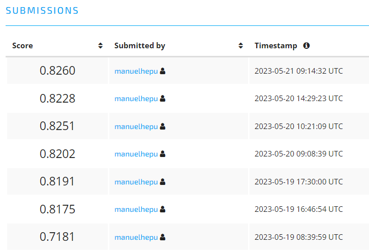

## 1. Introducción

Este proyecto consiste en predecir el estado de las bombas de agua de las comunidades de Tanzania. Con el objetivo principal de mejorar las operaciones de mantenimiento y garantizar que las comunidades de Tanzania dispongan de agua limpia y potable. Los datos provienen de la plataforma [DrivenData](https://www.drivendata.org/competitions/7/pump-it-up-data-mining-the-water-table/).

{width="297"}

## 2. Iteraciones en el proyecto

A continuación se indican las diferentes iteraciones realizadas en el proyecto.

### 1º. Iteración

-   Preprocesado
    -   Se han eliminado todas las variables que **no** son numéricas.(30 de 40 variables **eliminadas**)
-   Modelo
    -   Algoritmo: Random Forest
    -   Paquete: Ranger
    -   Parametrización: Opciones por defecto
-   Resultados (Accuracy):
    -   Local: 0.7828
    -   Plataforma: **0.7181**
-   Conclusión: Se obtiene una primera versión básica del modelo, desde la que se empezara a trabajar.

### 2º. Iteración

-   Preprocesado
    -   Se han **eliminado** las variables categóricas con más de 100 categorías diferentes. (7 variables eliminadas)
    -   Se ha **descompuesto** la variable "date_recorded" en 4 nuevas variables. Posteriormente se ha **eliminado** la variable "date_recorded"
    -   Se han **eliminado** las variables lógicas public_meeting y permit, ya que contienen valores missing.
    -   Se ha **eliminado** la variable recorde_by por solo contener una única categoría.
-   Modelo
    -   Algoritmo: Random Forest
    -   Paquete: Ranger
    -   Parametrización: Opciones por defecto
-   Resultados (Accuracy):
    -   Local: 0.8506
    -   Plataforma: **0.8175**
-   Conclusión: Al añadir las variables categóricas, comprobamos como la capacidad predictiva aumenta considerablemente.

### 3º. Iteración

-   Preprocesado
    -   Se han **eliminado** las variables categóricas con más de 100 categorías diferentes. (7 variables eliminadas)
    -   Se ha **descompuesto** la variable "date_recorded" en 4 nuevas variables. Posteriormente se ha **eliminado** la variable "date_recorded"
    -   Se ha **eliminado** la variable recorde_by por solo contener una única categoría, y las variables extraction_type, payment_type y quantity_group. Por aportar la misma información.
    -   Se han **creado 2 nuevas variables** binarias(fe_na_public_meeting, fe_na_permit), con la información de las observaciones que tienen valores Na.
    -   Se han **imputado** las valores Na de las observaciones a traves de una imputación de KNN Vecinos.
-   Modelo
    -   Algoritmo: Random Forest
    -   Paquete: Ranger
    -   Parametrización: Opciones por defecto
-   Resultados (Accuracy):
    -   Local: 0.8492
    -   Plataforma: **0.8191**
-   Conclusión: Mejoramos minimamente la iteración anterior con los nuevos cambios.

### 4º. Iteración

-   Preprocesado
    -   Se ha **descompuesto** la variable "date_recorded" en 4 nuevas variables. Posteriormente se ha **eliminado** la variable "date_recorded"
    -   Se ha **eliminado** la variable recorde_by por solo contener una única categoría, y las variables extraction_type, payment_type y quantity_group. Por aportar la misma información.
    -   Se han **creado 2 nuevas variables** binarias(fe_na_public_meeting, fe_na_permit), con la información de las observaciones que tienen valores Na.
    -   Se han **imputado** las valores Na de las observaciones a traves de una imputación de KNN Vecinos.
    -   Se ha realizado una **agrupación** en las variables categóricas que contienen categorias poco representativas(1%)
-   Modelo
    -   Algoritmo: Random Forest
    -   Paquete: Ranger
    -   Parametrización: Opciones por defecto
-   Resultados (Accuracy):
    -   Local: 0.8510
    -   Plataforma: **0.8202**
-   Conclusión: Mejoramos minimamente la iteración anterior con los cambios aplicados.

### 5º. Iteración

-   Preprocesado
    -   Se ha **descompuesto** la variable "date_recorded" en 4 nuevas variables. Posteriormente se ha **eliminado** la variable "date_recorded"
    -   Se ha **eliminado** la variable recorde_by por solo contener una única categoría, y las variables extraction_type, payment_type y quantity_group. Por aportar la misma información.
    -   Se han **creado 2 nuevas variables** binarias(fe_na_public_meeting, fe_na_permit), con la información de las observaciones que tienen valores Na.
    -   Se han **eliminado** las variables categóricas con más de 20000 categorías diferentes.
    -   Se realiza una **imputación** de las variables categóricas por su frecuencia.
    -   Se han **imputado** las valores Na de las observaciones a traves de una imputación de KNN Vecinos.
-   Modelo
    -   Algoritmo: Random Forest
    -   Paquete: Ranger
    -   Parametrización: Opciones por defecto
-   Resultados (Accuracy):
    -   Local: 0.8498
    -   Plataforma: **0.8251**
-   Conclusión: Comprobamos que con la imputación de las variables categóricas por su frecuencia, tenemos una muy buena mejora.

### 6º. Iteración

-   Preprocesado
    -   Se ha **descompuesto** la variable "date_recorded" en 4 nuevas variables. Posteriormente se ha **eliminado** la variable "date_recorded"
    -   Se ha **eliminado** la variable recorde_by por solo contener una única categoría, y las variables extraction_type, payment_type y quantity_group. Por aportar la misma información.
    -   Se han **creado 2 nuevas variables** binarias(fe_na_public_meeting, fe_na_permit), con la información de las observaciones que tienen valores Na.
    -   Se han **eliminado** las variables categóricas con más de 20000 categorías diferentes.
    -   Se realiza una **imputación** de las variables categóricas por su frecuencia.
    -   Se **transforman** los valores igual a 0 como Na de las variables construction_year, longitude y district_code.
    -   Se han **creado 3 nuevas variables** binarias(fe_na_construction_year, fe_na_longitude y fe_na_district_code.), con la información de las observaciones que tienen valores Na.
    -   Se han **imputado** las valores Na de las observaciones a traves de una imputación de KNN Vecinos.
-   Modelo
    -   Algoritmo: Random Forest
    -   Paquete: Ranger
    -   Parametrización: Opciones por defecto
-   Resultados (Accuracy):
    -   Local: 0.8488
    -   Plataforma: **0.8228**
-   Conclusión: Los nuevos cambios de imputación en las variables con valores Na, reducen mínimamente la capacidad predictiva.

### 7º. Iteración

-   Preprocesado

    -   Se ha **descompuesto** la variable "date_recorded" en 4 nuevas variables. Posteriormente se ha **eliminado** la variable "date_recorded"
    -   Se ha **eliminado** la variable recorde_by por solo contener una única categoría, y las variables extraction_type, payment_type y quantity_group. Por aportar la misma información.
    -   Se han **creado 2 nuevas variables** binarias(fe_na_public_meeting, fe_na_permit), con la información de las observaciones que tienen valores Na.
    -   Se han **eliminado** las variables categóricas con más de 20000 categorías diferentes.
    -   Se realiza una **imputación** de las variables categóricas por su frecuencia.
    -   Se han **imputado** las valores Na de las observaciones a traves de una imputación de KNN Vecinos.-

-   Modelo

    -   Algoritmo: Random Forest
    -   Paquete: Ranger
    -   Parametrización: Se realiza una fase de "tuning", para la busqueda de los mejores parametros para el modelo.

-   Resultados (Accuracy):

    -   Local: 0.8574
    -   Plataforma: 0.8260

-   Conclusión: En esta iteración se vuelve al preprocesdo de la iteración 5(Iteración con mejor resultado), y se aplica una fase de tuning para mejorar los resultados predictivos.

### Resultados obtenidos en la plataforma.

{width="509"}

## 3. Datos

El set de datos como he comentado anteriormente proviene del concurso de datos "Pump it Up: Data Mining the Water Table" de la plataforma de DrivenData.

### 3.1. Variables del dataset

-   amount_tsh - Total static head (amount water available to waterpoint)
-   date_recorded - The date the row was entered
-   funder - Who funded the well
-   gps_height - Altitude of the well
-   installer - Organization that installed the well
-   longitude - GPS coordinate
-   latitude - GPS coordinate
-   wpt_name - Name of the waterpoint if there is one
-   num_private -
-   basin - Geographic water basin
-   subvillage - Geographic location
-   region - Geographic location
-   region_code - Geographic location (coded)
-   district_code - Geographic location (coded)
-   lga - Geographic location
-   ward - Geographic location
-   population - Population around the well
-   public_meeting - True/False
-   recorded_by - Group entering this row of data
-   scheme_management - Who operates the waterpoint
-   scheme_name - Who operates the waterpoint
-   permit - If the waterpoint is permitted
-   construction_year - Year the waterpoint was constructed
-   extraction_type - The kind of extraction the waterpoint uses
-   extraction_type_group - The kind of extraction the waterpoint uses
-   extraction_type_class - The kind of extraction the waterpoint uses
-   management - How the waterpoint is managed
-   management_group - How the waterpoint is managed
-   payment - What the water costs
-   payment_type - What the water costs
-   water_quality - The quality of the water
-   quality_group - The quality of the water
-   quantity - The quantity of water
-   quantity_group - The quantity of water
-   source - The source of the water
-   source_type - The source of the water
-   source_class - The source of the water
-   waterpoint_type - The kind of waterpoint
-   waterpoint_type_group - The kind of waterpoint

### 3.2. Librerias necesarias para el proyecto

```{r, warning=FALSE, message=FALSE}
rm(list = ls())
library(tidymodels)
library(tidyverse)
library(DataExplorer)
library(ggpubr)
library(univariateML)
library(GGally)
library(doParallel)
library(data.table)
library(inspectdf)
library(geosphere)
library(missRanger)
library(geosphere)
```

### 3.3. Lectura datos

Realizamos la lectura de los ficheros CSV que nos ha proporcionado la plataforma.

```{r}
# Datos de entrenamiento
my_train <- as.data.frame(fread("data/train.csv"))
# Variable independiente de entrenamiento
target <- as.data.frame(fread("data/target.csv"))
# Datos de test
my_test <- as.data.frame(fread("data/test.csv"))
```

### 3.4. Unión train/test

Realizamos la unión de los dataset de train y test proporcionados, para poder aplicar los cambios efectuados en la totalidad de los datos.

```{r}
# Variable datos train y traget
full_train <- merge(x = my_train, y = target, by = c("id"))
# Variable independiente
status_group <- target$status_group
col_test <- names(my_test)[names(my_test) %in% names(my_train)]

# Variable datos train y test
full_data <- rbind(my_train, my_test[, col_test])
```

## 4. Análisis exploratorio de datos (EDA)

Existe un total de 41 variables en el dataset, repartidas con las siguientes categorias:

-   Caracter: 27
-   Fecha: 1
-   Boolean: 2
-   Numérica: 10

```{r, echo=FALSE}

# Tipo de variables de los datos
x <- inspect_types(full_data)
show_plot(x)
```

Muestra de los datos que conforman el dataset.

```{r, echo=FALSE}
# Datos
head(full_data)
```

En la siguiente gráfica podemos observar el uso de memoria de cada variable del dataset. Donde observamos que las variables cualitativas son la que más memoria ocupan.

```{r, echo=FALSE}

# Representación del uso de la memoria
x <- inspect_mem(full_data)
show_plot(x)
```

### 4.1. Número de observaciones ausentes

Observamos que los datos, solo contienen 2 columnas con valores Na. En concreto las 2 unicas variables de tipo lógica.

```{r, echo=FALSE}

# Observaciones ausentes
x <- inspect_na(full_train)
show_plot(x)
```

### 4.2. Variable respuesta

Comprobamos que una de las categorias de la variable a predecir(status_group), tiene una representación muy debil comparandose con el resto de categorias.

```{r, echo=FALSE}
# Numero de categorias de la variable objetivo
full_train %>%
  group_by(status_group) %>%
  summarise(total=n(), .groups = "drop_last") %>%
  mutate(status_group=reorder(status_group,total)) %>%
  ggplot(aes(status_group,total, fill=status_group)) +
  geom_bar(stat = "identity" )+
  geom_text(aes(label=total), vjust=0)+
  ylim(0,34000)+
  theme(axis.text.x=element_text(angle=-45, vjust=0.5,hjust=0))+
  ggtitle("Total number of wells by status_group")

```

### 4.3. Variables continuas

Observamos que en las variables continuas, existen variables con muchos valores igual a 0 (Podrian identificarse como posibles valores Na).

```{r, echo=FALSE}

# Gráficas de las variables numéricas
x <- inspect_num(full_train)
show_plot(x)
```

En la siguiente gráfica observamos las correlaciones entre las variables numéricas.

```{r, echo=FALSE}

# Correlaciones entre las variables numéricas
x <- inspect_cor(full_train)
show_plot(x)
```

### 4.4. Variables cualitativas

En el siguiente gráfico, podemos comprobar que existen numerosas variables cualitativas con un número elevado de categorías.

```{r, echo=FALSE, warning=FALSE, message=FALSE}

# Representación gráfica de las variables categóricas
x <- inspect_cat(full_train) 
show_plot(x)
```

También se puede comprobar como muchas de las variables cualitativas tienen en un elevado porcentaje la misma categoría.

```{r, echo=FALSE, warning=FALSE, message=FALSE}

# Categorías más representadas de las variables categóricas
x <- inspect_imb(full_train)
show_plot(x)
```

## 5. Preprocesado

Realizamos un preprocesado inicial.

Descomponemos la variable date_recorded, en 4 nuevas variables numéricas:

-   date_anio: Identifica el Año.
-   date_mes: Identifica el numero del mes.
-   date_diames: Ientifica el dia del mes.
-   date_diasem: Identifica el dia de la semana.

Por ultimo eliminamos la variable date_recorded.

```{r, echo=FALSE}

full_data$date_recorded <- ymd(full_data$date_recorded)

# Variable año
full_data$date_anio    <- year(full_data$date_recorded)
# Variable mes (1-12)
full_data$date_mes     <- month(full_data$date_recorded)
# Variable dia mes (1-30/31)
full_data$date_diames  <- day(full_data$date_recorded)
# Variable dia semana (1-7)
full_data$date_diasem  <- wday(full_data$date_recorded)

# Eliminamos variable
full_data$date_recorded <- NULL
```

Eliminamos las variables cualitativas con más de 20000 categorías. Ya que al contener un elevado numero de categorías no aportan ninguna mejora al modelo y dificulta su procesado. Se ha escogido el umbral de 20000, debido a que las variables con más de 20000 categorias tienen menos poder predictivo.

```{r, echo=FALSE}
# Seleccionamos las variables caracteres
full_data_cat <- full_data %>% select(where(is.character))
# Creamos dataframe con una fila de las columnas
categorias <- data.frame("variables" = names(full_data_cat),"categorias" = apply(full_data_cat, 2, function(x) length(unique(x))))
rownames(categorias) <- NULL
categorias <- categorias %>% arrange(categorias)
cat_mal <- categorias %>% filter(categorias > 20000) %>% select(variables)
full_data[ , full_data$variables] <- NULL

```

Eliminamos las variables extraction_type_group, payment_type y quantity_group, ya que incorporan la misma información al dataset.

```{r, echo=FALSE}

full_data$extraction_type_group <- NULL
full_data$payment_type <- NULL
full_data$quantity_group <- NULL
```

Eliminamos la variable recorde_by, ya que dicha variable cualitativa incorpora una unica categoría. Por lo que no aporta ninguna información.

```{r, echo=FALSE}

full_data$recorded_by <- NULL
```

Convertimos las variables cualitativas a numéricas, asignando la frecuencia de veces que aparece a cada obsevación.

```{r, echo=FALSE}
cat_cols <- full_data[, which(sapply(full_data, is.character))]
full_data_dt <- as.data.table(full_data)
for (col in names(cat_cols)){
  full_data_dt[ , paste0("fe_", col) := .N , by = col]
}
full_data <- as.data.frame(full_data_dt)
for (col in names(cat_cols)) {
  full_data[, paste(col)] <- NULL
}
```

Una vez realizado el preprocesado de los datos, volvemos a separar los datos de train y test.

```{r}
train <- full_data %>%
  mutate( index = 1:nrow(full_data)) %>%
  filter( index <= nrow(my_train)) %>%
  select( -index ) %>%
  mutate(status_group = as.factor(target$status_group))

test <- full_data %>%
  mutate( index = 1:nrow(full_data)) %>%
  filter( index > nrow(my_train)) %>%
  select( -index )
```

## 6. Modelado

El modelo que se ha aplicado para solventar el problema, es un modelo de bosques aleatorios. En concreto el implementado por ranger. El proceso de modelaje se ha realizado con la librería tidyverse de R.

```{r}
# =============================================================================
# DEFINICIÓN DEL MODELO Y DE LOS HIPERPARÁMETROS A OPTIMIZAR
# =============================================================================
modelo_rand_forest <- rand_forest(trees = tune(),
                                  min_n = tune()
                                  ) %>%
                      set_engine("ranger", importance = "impurity", seed=12345) %>%
                      set_mode("classification") 
```

Realizamos la imputación de los valores Na, aplicamos una imputación a traves del algoritmo KNN de los 3 vecinos más cercanos.

```{r}
# =============================================================================
# IMPUTACIÓN DEL LOS DATOS
# =============================================================================
# Realizamos la imputación de los valores Na por KNN
transformer <- recipe(
                  formula = status_group ~ .,
                  data =  train
               ) %>% step_impute_knn(all_predictors(), neighbors = 3)


```

Aplicamos una validación cruzada de 2 particiones.

```{r}
# =============================================================================
# DEFINICIÓN DE LA ESTRATEGIA DE VALIDACIÓN Y CREACIÓN DE PARTICIONES
# =============================================================================
set.seed(1234)
cv_folds <- vfold_cv(
              data    = train,
              v       = 2,
              strata  = status_group
            )
```

Para la bsqueda de los hiperparametros, utilizamos una optimazión bayesiana. Este tipo de busqueda, consiste en focalizar la busqueda en las regiones con mejores resultados.

```{r}
# =============================================================================
# EJECUCIÓN DE LA OPTIMIZACIÓN DE HIPERPARÁMETROS
# =============================================================================
# Paralelizamos la ejecución
registerDoParallel(cores = parallel::detectCores() - 1)

grid_fit2 <- tune_bayes(
              # Objeto modelo
              object  = modelo_rand_forest,
              # El objeto recipe no tiene que estar entrenado
              preprocessor = transformer,
              # Objeto validación cruzada
              resamples = cv_folds,
              # Iniciación aleatoria 25 modelos
              initial = 25,
              # Numero de iteraciones de optimización
              iter    = 25,
              # Métrica optimizada
              metrics = metric_set(accuracy),
              control = control_bayes(no_improve = 20, verbose = FALSE)
            )
# Detenemos la ejecución paralela
stopImplicitCluster()
```

Mostramos la mejor configuración de parámetros obtenida

```{r}

grid_fit2 %>% show_best(metric = "accuracy", n = 1)

```

En las siguiente graficas obtenemos un resumen de la evolución del Accuracy en función de los hiperparámetros. Donde podemos observar que el parametro "min_n" obtiene mejores resultados en valores comprendidos entre 3-10. Mientras que el parametro "trees" es más dispersos y obtiene buenos resultados con un alto rango de configuraciones.

```{r}

grid_fit2 %>%
  collect_metrics(summarize = TRUE) %>%
  filter(.metric == "accuracy") %>%
  select(-c(.estimator, n)) %>%
  pivot_longer(
    cols = c( trees, min_n),
    values_to = "value",
    names_to = "parameter"
  ) %>%
  ggplot(aes(x = value, y = mean, color = parameter)) +
  geom_point() +
  geom_line() + 
  labs(title = "Evolución del accuracy en función de los hiperparámetros") +
  facet_wrap(facets = vars(parameter), nrow = 2, scales = "free") +
  theme_bw() + 
  theme(legend.position = "none")

```

En esta gráfica podemos observar más claramente donde se ha centrado la búsqueda de hiperparámetros.

```{r}
grid_fit2 %>%
  collect_metrics(summarize = TRUE) %>%
  filter(.metric == "accuracy") %>%
  select(-c(.estimator, n)) %>%
  ggplot(aes(x = trees, y = min_n, color = mean, size = mean)) +
  geom_point() +
  scale_color_viridis_c() +
  labs(title = "Evolución del error en función de los hiperparámetros") +
  theme_bw()

```

## 7. Modelo final

Con la mejor configuración obtenida, construimos el modelo final.

```{r}

# Seleccionamos el mejor modelo seguna la metrica accuracy
mejores_hiperpar <- select_best(grid_fit2, metric = "accuracy")
modelo_forest_final <- finalize_model(x = modelo_rand_forest, parameters = mejores_hiperpar)

# Entrenamos el objeto recipe para la imputación de los valores Na en los datos de test
transformer_fit <- prep(transformer)


# Ejecutamos nuevamente el modelo con la mejor configuración de parámetros
modelo_rand_forest_fit <- modelo_forest_final %>%
                           fit(
                             formula = status_group ~ .,
                             data    = bake(transformer_fit, new_data = train)
                           )


```

Una vez realizado el modelo, podemos ver las variables más importantes del modelo generado. Donde comprobamos que la variable fe_quantity es la variable con mayor poder predictivo.
```{r}
vars_imp <- modelo_rand_forest_fit$fit$variable.importance
vars_imp <- as.data.frame(vars_imp)
vars_imp$myvar <- rownames(vars_imp)
vars_imp <- as.data.table(vars_imp)
setorder(vars_imp, -vars_imp)
ggbarplot(vars_imp,
          x = "myvar", y = "vars_imp",
          color = "purple",             
          palette = "jco",            
          sort.val = "asc",          
          sort.by.groups = FALSE,     
          x.text.angle = 90,          
          ylab = "Importancia",
          xlab = 'Variable', 
          rotate = TRUE,
          ggtheme = theme_minimal())
```

## 8. Predicción

Una vez tenemos el mejor modelo, realizamos la predicción con los datos de test

```{r}

predicciones <- modelo_rand_forest_fit %>%
                predict(
                  new_data = bake(transformer_fit, new_data = test),
                  type = "class"
                )
```

## 9. Exportamos resultados

Exportamos los datos a un fichero csv, con el formado indicado en la plataforma.

```{r}

submission <- data.table(id = test$id, status_group = predicciones)
colnames(submission) <- c('id','status_group')
write.csv(submission, "data/submission.csv", row.names = FALSE)
```
